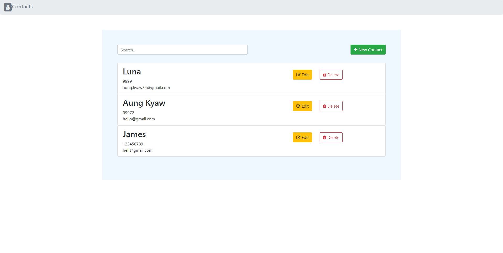
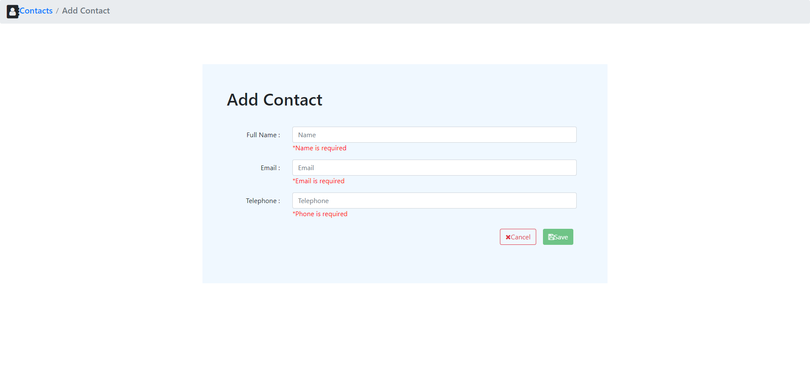
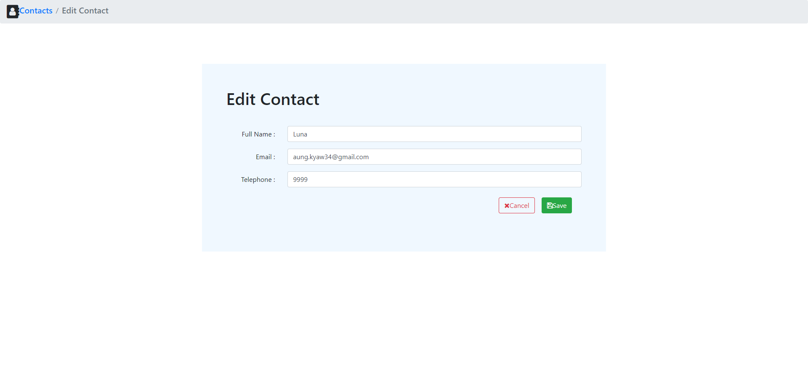

# contact_app-xerovit
Contact App 

# Specifications
Back-end : JSON server (https://www.npmjs.com/package/json-server)

Front-end : Angular ( Version ~ 9)

# Features
1. Show contact list

2. User can add / edit and delete contacts

3. User can filter throught contacts

4. Confirm dialog will shown when user try to delete any contacts

5. Confirm dialog will shown when user try to add new contact with already existed phone or email

# Screens
1. ShowContactListScreen

2. AddContactScreen

3. EditContactScreen

